## K8s-Weather-Application

I built a weather app as a hands-on way to deploy a real containerized application on Kubernetes and demonstrate production-grade concepts like high availability, auto-scaling, and rolling updates.

The app itself is straightforward, you open it in the browser, it asks for your location, and shows you the current temperature, humidity, and weather condition for wherever you are. Weather data comes from [Open-Meteo](https://open-meteo.com/) as it's free and no API key is needed, and the location name is resolved from your coordinates using [OpenStreetMap's Nominatim](https://nominatim.org/).

But the real focus here is the infrastructure and how I orchestrated the app with Kubernetes.

---

### How It Works

The app runs with a minimum of **two replicas at all times**, so if one pod crashes the other keeps serving traffic with no downtime. I set up a **Horizontal Pod Autoscaler** that monitors CPU usage and automatically scales the deployment from 2 up to 5 pods under load. Every pod has **liveness and readiness probes** so Kubernetes knows when a pod is healthy enough to receive traffic and when it needs to be restarted. Resource requests and limits are defined on every container, which is actually a hard requirement for the HPA's CPU metrics to function correctly.

The whole thing is containerized with Docker and the Kubernetes manifests are clean and reusable. Anyone can clone the repo, point it at their own cluster, and have it running in a few minutes.

---

### Project Structure

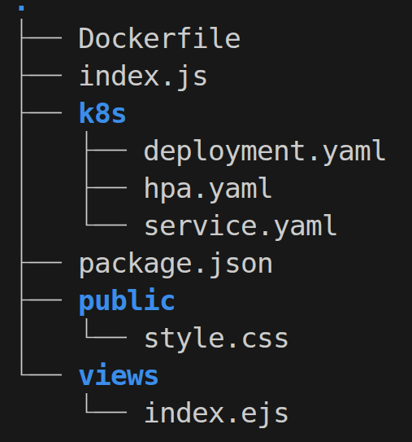

---

### Run the Application Locally with Node.js

I ran the app locally first with Node.js to test that it works fine.

```bash
npm install # If not installed
npm start   # Must be standing on the folder that contains "index.js"
```

The app was now accessible locally at `http://localhost:3000`

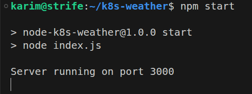

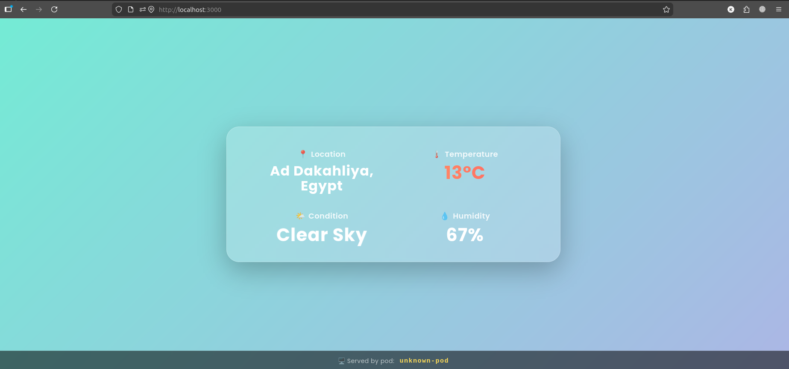

I added a line in the code that shows the pod name for future testing.

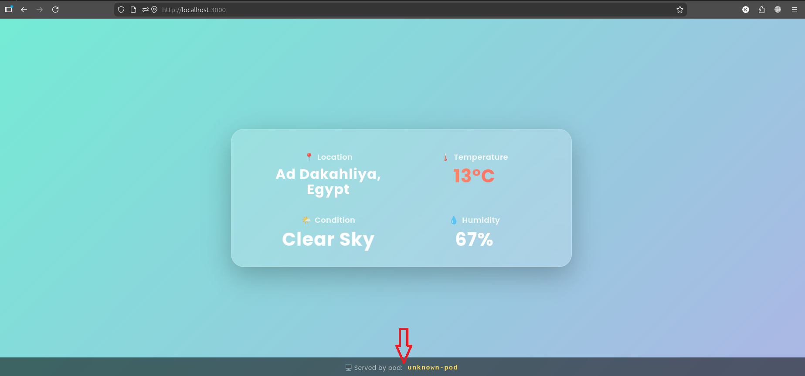

---

### Run the Application with Docker

I made a **Docker** image of the application so I could push it to my **DockerHub**, which I'd use in the **Kubernetes** deployment.

I started by building the image:

```bash
docker build -t kmwahba/weather-app:latest .
```

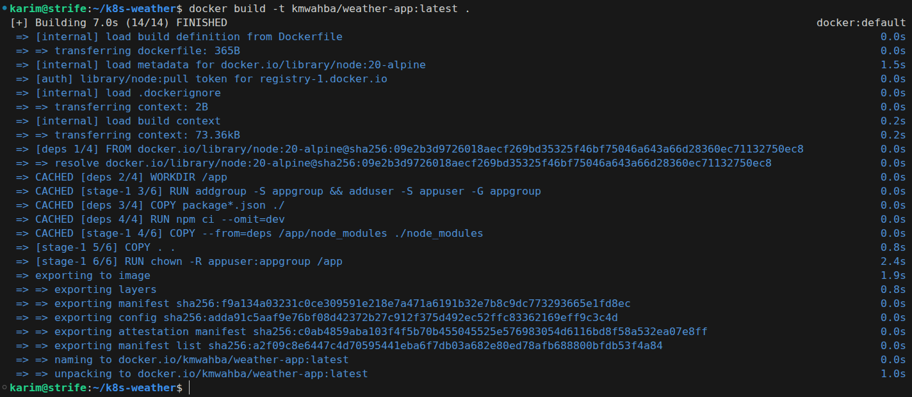

Then I logged in to DockerHub and pushed the image. Most layers already existed because I had pushed it before.

```bash
docker login
docker push kmwahba/weather-app:latest
```

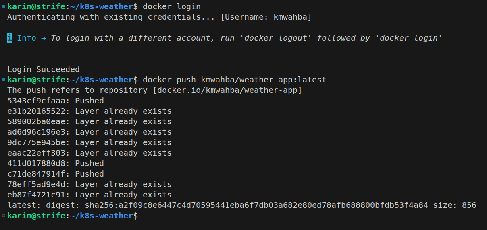

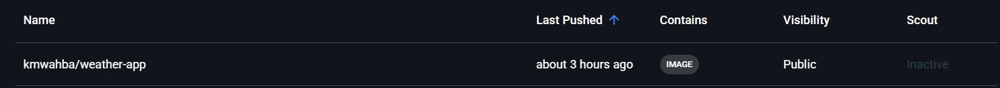

Then I ran the container:

```bash
docker run -p 3000:3000 kmwahba/weather-app:latest
```

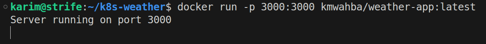

The name shown at the bottom is not actually a pod name, it's the container ID. In `index.ejs` the pod banner is always rendered with no condition around it. It just displays whatever `HOSTNAME` is, whether that's a Kubernetes pod name, a Docker container ID, or even the local machine name.

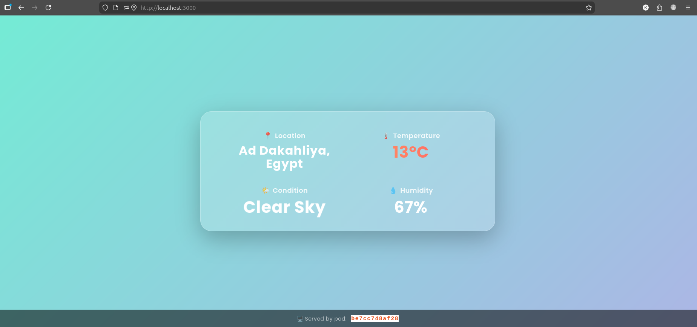

I listed the existing images and filtered with `grep` for the one I just created:

```bash
docker images | grep weather-app
```


---

### Deploy to Kubernetes

I started `minikube` since it wasn't already running:

```bash
minikube start
```

I also enabled the `metrics-server` add-on since it's required for the HPA to read CPU usage. Without it, auto-scaling won't work:

```bash
minikube addons enable metrics-server
```

Then I applied all the manifests:

```bash
kubectl apply -f k8s/
```

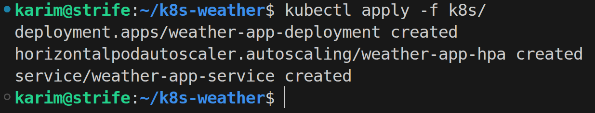

I then verified everything was running:

```bash
kubectl get all
```

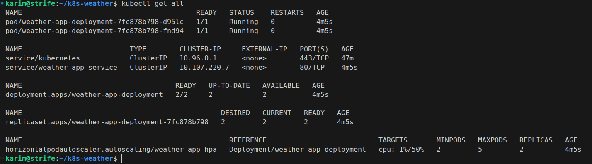

Since the service was `ClusterIP` it's not exposed externally, so I used port-forwarding to access it locally:

```bash
kubectl port-forward svc/weather-app-service 8080:80
```

I opened `http://localhost:8080` and the app was fully working.

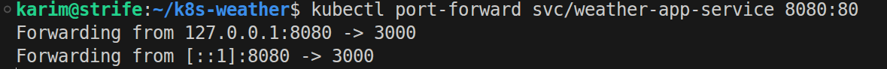

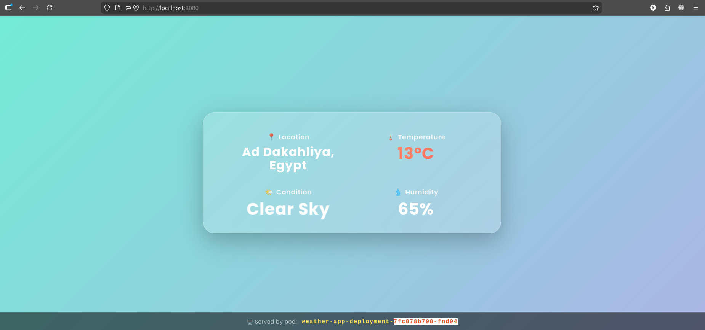

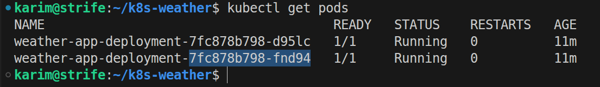

---

## Testing Kubernetes Concepts

### Test 1: High Availability (Pod Failure)

I wanted to prove that the app stays up even when a pod dies.

https://github.com/user-attachments/assets/dec1b76d-7553-48d8-8f1c-7892aa2f9bc7

- The deleted pod went `Terminating`
- A new pod immediately went `Pending` → `ContainerCreating` → `Running`
- The whole recovery took about 10–15 seconds

> **Note:**
> `kubectl port-forward` connects to a specific **pod**, not to the **service**. When I deleted that exact pod, `port-forward` lost its connection because the pod it was tunneled into was gone. That's why I had to restart it after deleting the pod. I later switched to `LoadBalancer` to fix this, more on that in Test 3.

---

### Test 2: Auto-Scaling with HPA

I generated real CPU load to trigger the HPA to scale up.

I used `hey` for load testing, it basically sends a large number of **HTTP** requests to put load on the application.

https://github.com/user-attachments/assets/799f1e38-a414-4e5c-8b11-5437e5bb6aeb

- The CPU% climbed. Once it crossed 50%, the HPA kicked in.
- After the load stopped, I waited a few minutes and it scaled back down to 2 automatically. The HPA has a built-in cooldown period before scaling down to avoid thrashing.

---

### Test 3: Rolling Updates

I made a small visible change to the app, swapped the background gradient color, then built and pushed the new image to DockerHub:

```bash
docker build -t kmwahba/weather-app:v2 .
docker push kmwahba/weather-app:v2
```

Then I triggered the rolling update:

```bash
kubectl set image deployment/weather-app-deployment weather-app=kmwahba/weather-app:v2
```

https://github.com/user-attachments/assets/f126d94f-5f7e-4155-bc2e-509f2dd2d333

While testing the K8s concepts I noticed that `kubectl port-forward` drops every time a pod is replaced or deleted. That's because port-forward connects directly to a specific pod, not through the service, so when that pod dies, the tunnel dies with it.

The fix was switching the service type to `LoadBalancer` and using `minikube tunnel`, which routes traffic through the service layer and stays up no matter what happens to individual pods.

I updated the service to:

```yaml
apiVersion: v1
kind: Service
metadata:
  name: weather-app-service
spec:
  selector:
    app: weather-app
  ports:
    - port: 80
      targetPort: 3000
  type: LoadBalancer
```

Then I reapplied it:

```bash
kubectl apply -f k8s/service.yaml
```

And ran `minikube tunnel`. It creates a network route from my machine into the minikube cluster so that `LoadBalancer` services get a real external IP that I can reach from the browser.

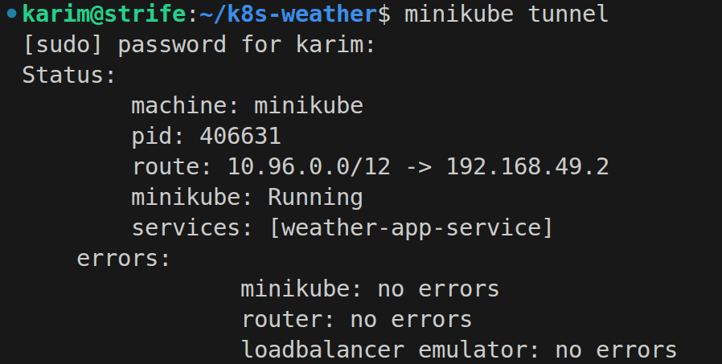

I got the external IP with:

```bash
kubectl get service weather-app-service
```

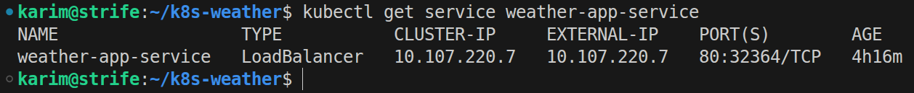

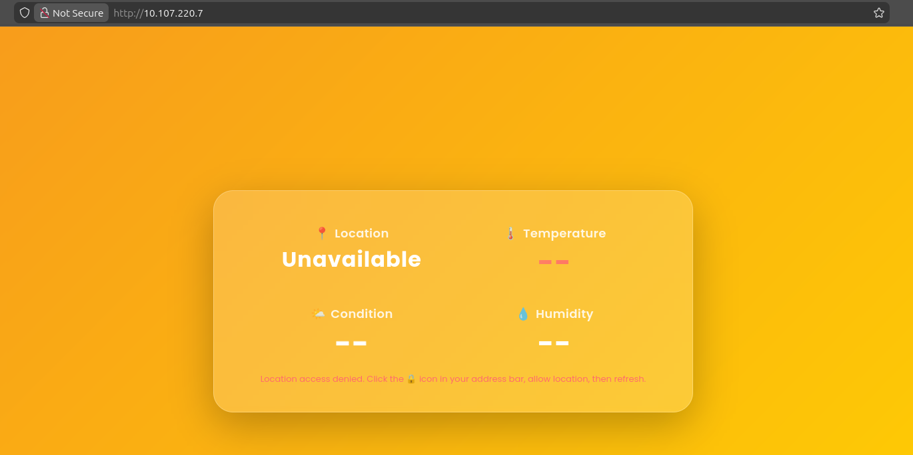

The app was working and the new background color confirmed the rolling update went through successfully.

The "access denied" error was a **browser security restriction**, not a Kubernetes problem, browsers block the Geolocation API on `http://` and only allow it on `https://` or `localhost`. To verify the app and routing were working correctly, I used curl instead:

```bash
curl -w "\n" "http://10.107.220.7/weather?lat=30.7&lon=31.4"
```
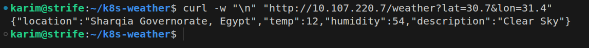

Or for better readability:

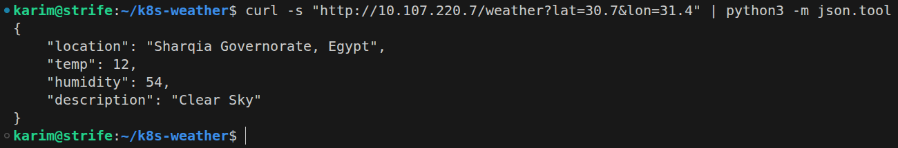

This bypassed the browser restriction entirely and confirmed the service was routing correctly and the app was responding as expected.

---

### What I Learned

Working on this project showed me that the small details in Kubernetes really matter. I learned that resource requests must be set for the HPA to work, readiness probes exist for a reason, and `port-forward` is just a debugging tool not something you rely on for real traffic. Every problem I hit taught me something, and seeing the app scale, recover, and update in real time made everything click.

---
